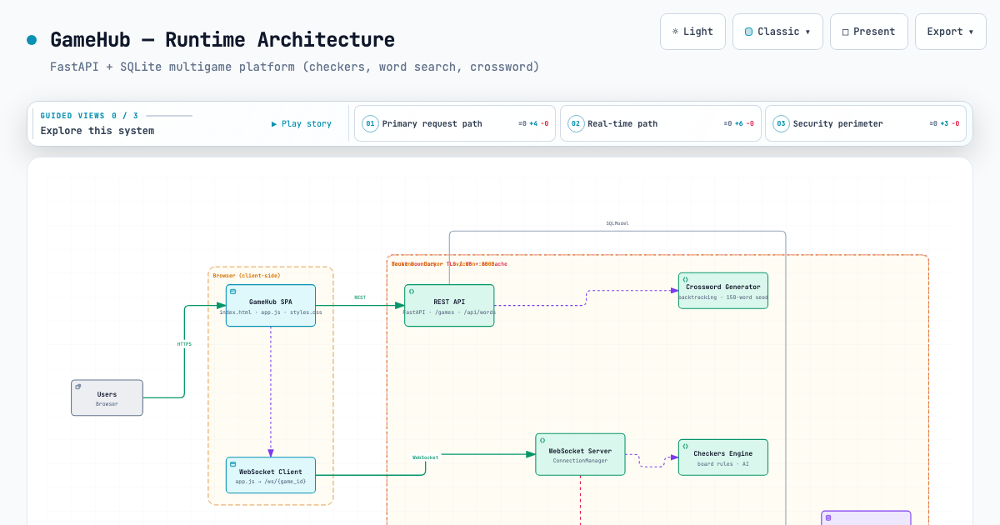

# GameHub

A lightweight web game platform built with **FastAPI** and **WebSockets**. Play **Checkers**, **Word Search**, and **Crossword** online — free, no login required.

- **Checkers** – classic 8×8 draughts. Play against a built-in minimax AI or a friend over WebSocket.
- **Caça-Palavras (Word Search)** – find hidden words across categories and difficulty levels, with a timer and local leaderboard.
- **Palavras Cruzadas (Crossword)** – crosswords generated dynamically on the server (backtracking), solved solo or collaboratively online via WebSocket.

## Tech Stack

- **Python 3.11+** – language
- **FastAPI** – web framework (REST + WebSocket)
- **SQLModel** – ORM for SQLite persistence
- **Uvicorn** – ASGI server
- **Pytest + httpx** – testing
- **Minimax** – checkers AI algorithm
- **Docker / docker-compose** – containerized deployment

## Project Structure

```
├── app/
│   ├── main.py         # FastAPI routes, static mounts, seeding & server init
│   ├── models.py       # DB models (Game, Move, Word)
│   ├── schemas.py      # Pydantic response schemas
│   ├── database.py     # SQLAlchemy engine & init
│   └── websocket.py    # ConnectionManager & WS handler (checkers + crossword)
├── games/
│   ├── checkers/
│   │   ├── game.py     # Checkers board logic
│   │   ├── ai.py       # Minimax AI
│   │   ├── static/     # Canvas board UI
│   │   └── tests/
│   ├── crossword/
│   │   ├── models.py   # Word model
│   │   ├── words.py    # 150-word seed dictionary (5 categories)
│   │   ├── generator.py# Backtracking crossword generator
│   │   ├── static/     # Grid + clues UI
│   │   └── tests/
│   └── wordsearch/
│       └── static/     # Client-side grid game + timer
├── static/             # Shared SPA shell (index.html, app.js, styles.css)
├── docs/
│   └── archify/        # Runtime architecture diagram (frontend/backend/security)
├── tests/              # API, WebSocket & integration suites
├── Dockerfile
├── docker-compose.yml
├── pyproject.toml
└── requirements.txt
```

## Quick Start

1. **Create a virtual environment** and install dependencies:
   ```bash
   python3 -m venv .venv
   source .venv/bin/activate
   pip install -r requirements.txt
   ```

2. **Run the server**:
   ```bash
   uvicorn app.main:app --reload
   ```

   Or with Docker:
   ```bash
   docker compose up --build
   ```

3. **Open** [http://localhost:8000](http://localhost:8000) in your browser.

4. Pick a game card, choose the difficulty, and play. For online checkers/crossword, the game runs over a WebSocket.

## API Endpoints

| Method | Path              | Description                                          |
|--------|-------------------|------------------------------------------------------|
| POST   | `/games`          | Create a game (`game_type`: `checkers`\|`crossword`, `difficulty`: `easy`\|`medium`\|`hard`, default `easy`) |
| GET    | `/games/{id}`     | Get game status                                      |
| POST   | `/api/words`      | Add a word to the dictionary (`difficulty`: int `1`–`3`) |
| GET    | `/api/words`      | List words (filters: `category`, `difficulty`: int `1`–`3`) |
| WS     | `/ws/{id}`        | WebSocket for real-time moves                        |
| GET    | `/`               | Serves the client UI                                 |

## WebSocket Protocol

Messages are JSON. The payload type depends on the game:

**Checkers**
- **Client → Server**: `{"type": "move", "from": [r,c], "to": [r,c]}`
- **Server → Client**: `{"type": "board", "board": [8][8]}` after every move
- **Server → Client**: `{"type": "game_over", "winner": "w"|"b"}`

**Crossword**
- **Server → Client** (on connect): `{"type": "crossword_init", "size", "num_grid", "across_clues", "down_clues", "filled"}`
- **Client → Server**: `{"type": "move", "row", "col", "letter"}` (validated server-side against the solution)
- **Server → Client**: `{"type": "crossword_update", "row", "col", "letter"}` broadcast to all players
- **Server → Client**: `{"type": "game_over", "winner"}`

**Common**
- **Server → Client**: `{"type": "error", "message": "..."}`
- **Server → Client**: `{"type": "color", "color": "w"|"b"}` player assignment (max 2 per game)

## Architecture

The platform follows a hub-and-spoke model:

1. **FastAPI** serves static assets, REST endpoints, and a WebSocket route.
2. **SQLite** persists games, moves, and the word dictionary via SQLModel (150 words seeded on startup).
3. **Board / puzzle state** is held in-memory by the `ConnectionManager`; crossword puzzles are generated by `games/crossword/generator.py` and validated letter-by-letter on the server.
4. **Checkers AI** runs as synchronous minimax inside the WebSocket event loop.
5. **Client** is a single-page app (per-game modules under `games/*/static/`) that renders the board/grid and handles interactions.

An interactive runtime diagram (frontend, backend, and security/trust boundaries) is available at
[`docs/archify/gamehub-runtime.architecture.html`](docs/archify/gamehub-runtime.architecture.html)
(source: [`gamehub-runtime.architecture.json`](docs/archify/gamehub-runtime.architecture.json)).



## Running Tests

```bash
source .venv/bin/activate
pytest -v
```

Covers the API, WebSocket flow (checkers + crossword), crossword generator/word logic, and overall project structure.

## License

MIT